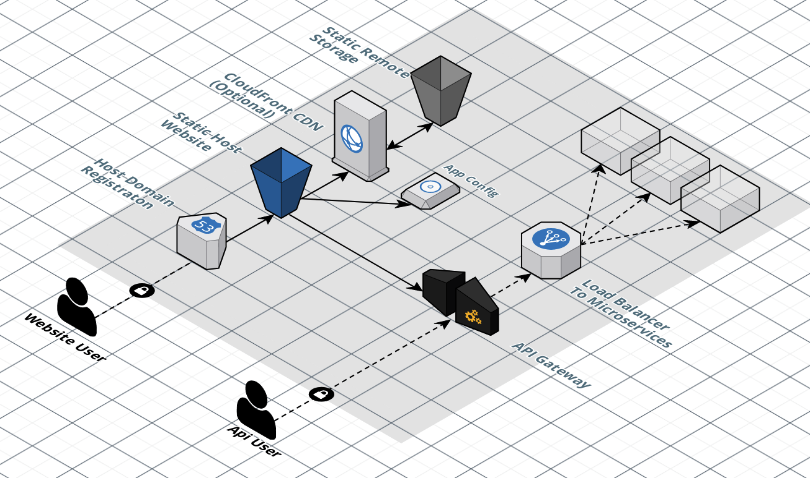

# Microfrontends Hosted in AWS Using S3

In AWS, microfrontends can be efficiently hosted using S3, leveraging its capabilities for hosting static websites. This architecture typically involves the following components:

## Static Website Hosting on S3:

Each microfrontend is stored in an S3 bucket configured to serve static web content.
The S3 bucket is set up as a static website, allowing users to access the content over the web.

## Static Remote Storage:

JavaScript remote assets required for the microfrontends are also stored in S3.
These assets can include various modular components that are federated across different parts of the application.

## App Configuration:

Basic app configuration is managed in a key-value pair structure, stored in a file system or another S3 bucket.
This configuration may include information such as API endpoints, feature flags, and other runtime configurations needed by the microfrontends.

## Content Delivery Network (CDN):

To enhance performance and ensure low latency, a CDN such as CloudFront is utilized.
CloudFront handles the caching and distribution of the static content across various edge locations, closer to the users.

## Domain Registration and Load Balancing:

The domain for the microfrontends is registered using Route 53.
Route 53 helps direct traffic to the appropriate S3 buckets.
Load balancers can be used to manage requests to underlying microservices and APIs hosted elsewhere.

## API Gateway:

An API Gateway integrates with various microservices, acting as a single entry point for API requests.
This gateway can route requests to the appropriate microservices based on the configuration.
Diagram Key Points

## User Access:

Website users access content hosted on S3 via Route 53.
API users send requests to the API Gateway.
Content and Configuration Fetching:

The static website and remote assets are fetched by Route 53 and CloudFront from the S3 buckets.
App configurations are fetched by the client from a designated configuration storage (often another S3 bucket or a designated key-value storage system).

## Microservice Communication:

The API Gateway helps route API calls to the appropriate microservices.
Load balancers distribute the load among the microservices to ensure high availability and reliability.
