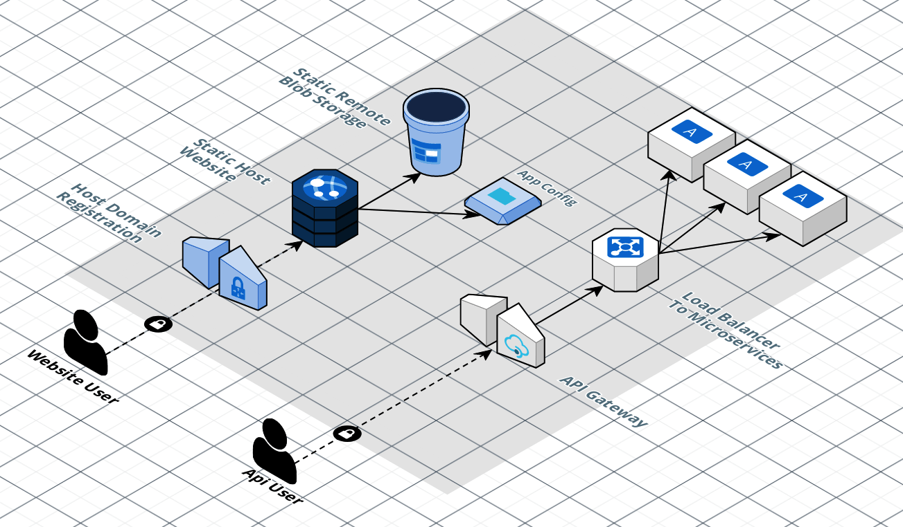

# Microfrontends Hosted in Azure Using Blob Storage

In Azure, microfrontends can be efficiently hosted using blob storage and static web apps, leveraging its capabilities for hosting static websites. This architecture typically involves the following components:

### Overview

This guide provides an overview of hosting microfrontends in Azure. The architecture comprises the following primary components:

1. **Static Host Website**: The main web application, served through Azure Static Web Apps, offering fast, global delivery of static assets.
  
2. **Host Domain Registration**: Custom domain registration for directing and securing user requests.
  
3. **Static Remote Blob Storage**: Azure Blob Storage used for storing JavaScript remote assets for various microfrontends.
  
4. **App Configuration**: Key-value pair configurations managed in Azure App Configuration for each microfrontend.
  
5. **Load Balancer to Microservices**: Azure Load Balancer for distributing requests to backend microservices.

6. **API Gateway**: Single entry point for API traffic, managed and routed to backend microservices through the Azure API Gateway.

### Explanation

1. **Static Host Website**
   - **Service**: Azure Static Web Apps
   - **Description**: Hosts the primary static frontend content.
   - **Function**: Delivers a fast and global web experience.

2. **Host Domain Registration**
   - **Service**: Azure custom domain registration
   - **Description**: Secures and directs user traffic.
   - **Function**: Ensures users access the correct web resources.

3. **Static Remote Blob Storage**
   - **Service**: Azure Blob Storage
   - **Description**: Stores JavaScript remote assets for microfrontends.
   - **Function**: Provides scalable and reliable delivery of static content.

4. **App Configuration**
   - **Service**: Azure App Configuration
   - **Description**: Manages application settings.
   - **Function**: Maintains key-value pairs and configurations for microfrontends.

5. **Load Balancer to Microservices**
   - **Service**: Azure Load Balancer
   - **Description**: Distributes traffic to backend services.
   - **Function**: Ensures high availability and performance.

6. **API Gateway**
   - **Service**: Azure API Gateway
   - **Description**: Routes and manages API traffic.
   - **Function**: Provides a single entry point for APIs, routing to the appropriate backend services.

### User Flow

1. **Website User Request**: Users access the hosted static website through the registered custom domain.
  
2. **Configuration Fetch**: The host application fetches necessary configurations from Azure App Configuration.
  
3. **Static Assets Load**: JavaScript remote assets are loaded from Azure Blob Storage as required by various microfrontends.
  
4. **API Requests**: API requests submitted by the web application or API users are handled through the API Gateway.

5. **Traffic Distribution**: The load balancer ensures even distribution of API requests to the microservices, maintaining optimal performance and reliability.

This architecture facilitates a modular, scalable, and efficient way to manage and deploy microfrontends, utilizing Azure's comprehensive services to ensure performance, security, and maintainability.